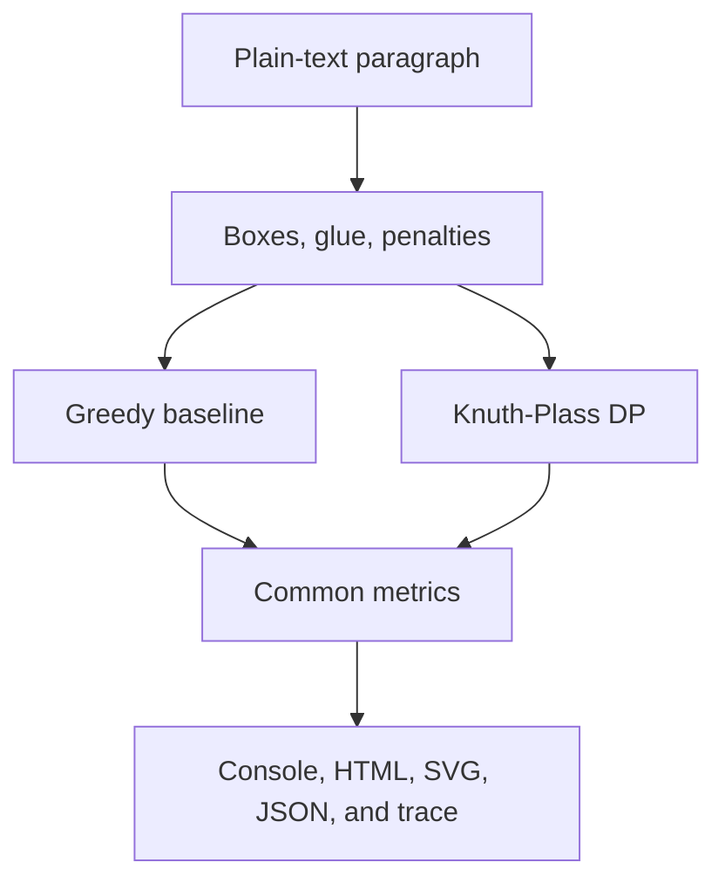

# Knuth-Plass Line-Breaking Laboratory

[](https://github.com/andrii2g/knuth-plass-line-breaking/actions/workflows/ci.yml)

CLI application that makes paragraph layout observable. It compares greedy wrapping with a simplified, deterministic Knuth-Plass implementation that chooses line breaks globally using boxes, glue, penalties, cubic badness, fitness classes, and dynamic programming.

This repository is intentionally bounded: it teaches the optimization algorithm, not production font shaping. It uses deterministic synthetic text metrics, accepts one paragraph and a target width, prints a comparison, and writes standalone HTML, SVG, JSON, and optional trace artifacts.

## What it demonstrates

- A locally attractive break can create an expensive later line.
- Flexible spaces have natural width, stretch, and shrink.
- Cubic badness makes severe distortion disproportionately costly.
- Penalties represent optional, forbidden, and forced breaks.
- Fitness-class demerits encourage consistent adjacent lines.
- Paragraph breaking is a shortest-path problem over a breakpoint DAG.
- Prefix sums make each candidate line measurable in constant time.



## Requirements

The repository pins .NET SDK 10.0.400 in `global.json`.

```powershell
dotnet restore
dotnet build --configuration Release --no-restore
dotnet test --configuration Release --no-build
```

## Run the flagship example

```powershell
dotnet run --project src/KnuthPlass.Cli --configuration Release --no-build -- `
  --file examples/global-vs-greedy.txt `
  --width 32 `
  --output artifacts `
  --trace
```

The measured default-options result is:

| Algorithm | Lines | Break path | Total demerits |
|---|---:|---|---:|
| Greedy | 5 | B00 -> B05 -> B10 -> B15 -> B22 -> B24 | 13,312.50 |
| Knuth-Plass | 5 | B00 -> B05 -> B10 -> B15 -> B21 -> B24 | 1,481.46 |

Knuth-Plass moves the penultimate break, reducing total demerits by 11,831.04, or 88.87%. These numbers were produced by the implementation at width 32 and are frozen by a regression test; they are not benchmark or production-typography claims.

The run creates exactly five fixed-name artifacts:

```text
artifacts/comparison.html
artifacts/layout-comparison.svg
artifacts/breakpoint-graph.svg
artifacts/trace.txt
artifacts/summary.json
```

The HTML and SVG files are standalone and require no network access. Verify an artifact set with:

```powershell
./scripts/verify-artifacts.ps1 -OutputDirectory artifacts
```

Use `--help` for all options, algorithms, input limits, and exit codes.

## Approximation limits

This is a teaching implementation, not TeX and not a production text engine.

- Word width is the count of Unicode scalar values; installed fonts do not affect it.
- Whitespace separates words and is normalized into configurable glue.
- There is no shaping, kerning, grapheme-aware measurement, language-aware hyphenation, or font fallback.
- The model covers one paragraph and a fixed line width. It does not paginate or handle variable-width regions.
- The implementation uses TeX-inspired boxes, glue, penalties, badness, fitness classes, and demerits, but it does not claim TeX compatibility.

These limits make solver decisions deterministic and the arithmetic easy to inspect. They also mean the rendered diagrams explain the model rather than predict real glyph placement.

## Repository map

| Path | Purpose |
|---|---|
| `docs/algorithm.md` | Mathematical model and pseudocode |
| `docs/architecture.md` | Projects, components, data flow, and dependency rules |
| `docs/adr/` | Detailed architecture decisions |
| `docs/cli-and-artifacts.md` | CLI contract and deterministic output formats |
| `docs/testing.md` | Unit, integration, golden, and invariant test catalogue |
| `examples/` | Deterministic teaching paragraphs |
| `scripts/verify-artifacts.ps1` | Release and CI artifact parser |

Production dependencies flow from CLI to Rendering and Core, and from Rendering to Core. Core has no production project dependencies.

## Determinism and safety

The solvers use a single epsilon-aware tie policy and immutable result data. Untrusted input is length-bounded, invalid UTF-8 is rejected, XML-invalid characters are replaced deterministically, and renderer inputs must match the paragraph and options captured by each result. Artifact publication uses fixed filenames and rollback-aware atomic promotion.

The documents under `docs/` describe the algorithm, architecture, command-line contract, and verification strategy. The CI workflow performs restore, Release build, all tests, two flagship runs, exact result checks, and byte-for-byte verification of all five artifacts.
