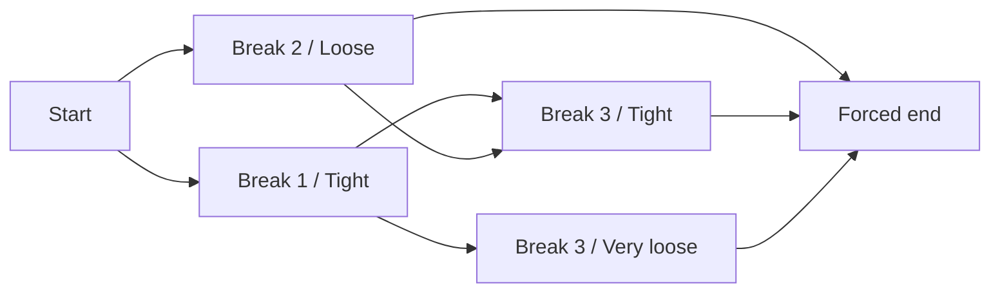

# Algorithm specification

## 1. Item model

A paragraph is an ordered sequence of items:

- `Box(text, width)`: fixed material that cannot break internally.
- `Glue(width, stretch, shrink)`: flexible whitespace. A break is legal after glue when preceded by a box.
- `Penalty(width, value, flagged)`: a potential break. Its width is counted only when the break is taken.

Sentinels:

- `value >= 10000`: forbidden break.
- `value <= -10000`: forced break.
- otherwise: optional penalty.

The tokenizer produces `Box word, Glue, Box word, ...` and a final forced penalty. The synthetic start breakpoint lies before item zero.

## 2. Candidate line boundaries

For a line from breakpoint `a` to breakpoint `b`:

1. Start immediately after the item at `a`, or at item zero for the synthetic start.
2. End at the break item for `b`.
3. Do not count discardable glue at the end of the line.
4. Count a penalty's width only when breaking at that penalty.
5. The next line begins after the chosen break and skips discardable leading glue.

Centralize these rules in `LineMeasurement`; duplicated boundary arithmetic is prohibited.

## 3. Prefix sums

For item prefix ending before index `k`, store:

\[
P_w(k)=\sum_{i<k} width_i,\quad
P_s(k)=\sum_{i<k} stretch_i,\quad
P_h(k)=\sum_{i<k} shrink_i
\]

Then a normalized range `[i,j)` is:

\[
L=P_w(j)-P_w(i),\quad
S=P_s(j)-P_s(i),\quad
H=P_h(j)-P_h(i)
\]

This makes a candidate evaluation O(1) after O(n) preprocessing.

## 4. Adjustment ratio

Given target width `W`, natural width `L`, total stretch `S`, and total shrink `H`:

\[
r =
\begin{cases}
0 & \text{if } |W-L|\le\epsilon \\
\frac{W-L}{S} & \text{if } W>L \text{ and } S>0 \\
\frac{W-L}{H} & \text{if } W<L \text{ and } H>0 \\
+\infty & \text{if } W>L \text{ and } S=0 \\
-\infty & \text{if } W<L \text{ and } H=0
\end{cases}
\]

Ordinary feasibility is:

\[
-1 \le r \le r_{max}
\]

where `r_max` defaults to 3. A ragged final line is feasible when its natural width does not exceed `W`; its scoring ratio is normalized to zero so unused last-line width is not punished. `LastLineMode.Justified` applies the ordinary formula instead.

## 5. Badness and fitness

For finite feasible `r`:

\[
b=\min(10000,\;100|r|^3)
\]

Fitness class:

| Class | Ratio |
|---|---|
| `VeryTight` | `r < -0.5` |
| `Tight` | `-0.5 <= r <= 0.5` |
| `Loose` | `0.5 < r <= 1` |
| `VeryLoose` | `r > 1` |

The names preserve the proposed educational model even though classic TeX commonly labels the middle class `Decent`.

## 6. Demerits

Let `q` be the configured line penalty, `b` badness, and `p` the breakpoint penalty:

\[
d_{base}=(q+b)^2
\]

Then:

\[
d_{penalty}=
\begin{cases}
p^2 & p\ge0 \text{ and } p<10000 \\
-p^2 & -10000<p<0 \\
0 & p\le-10000
\end{cases}
\]

Forced-break sentinels never receive a squared reward. Clamp the candidate line demerits to at least zero after applying a negative penalty, preventing a negative edge cost in this educational shortest-path formulation.

Add `fitnessDemerit` when adjacent fitness-class ordinal values differ by more than one. Add `flaggedDemerit` when both the predecessor break and current break are flagged.

\[
D_{new}=D_{prev}+\max(0,d_{base}+d_{penalty})+d_{fitness}+d_{flagged}
\]

Use `double`, reject non-finite intermediate values, and compare totals with configured epsilon.

## 7. Dynamic-programming state

The state must be `(breakpoint, fitnessClass)`, not only `breakpoint`: the cost of the next edge depends on the previous fitness class. Each state holds total demerits, line count, predecessor state, selected line metrics, and whether its break was flagged.



Keeping multiple fitness states at the same breakpoint prevents premature loss of a path that is slightly dearer now but cheaper after the next fitness transition.

## 8. DP pseudocode

```text
states[start, Tight] = zero-cost synthetic state

for end in legal breakpoints ascending:
    for startState in all reachable earlier states ascending:
        candidate = Measure(startState.breakpoint, end)
        emit CandidateEvaluated

        if candidate infeasible:
            emit CandidateRejected
            continue

        next = Accumulate(startState, candidate)
        key = (end, candidate.fitness)

        if key absent or next wins deterministic comparison:
            states[key] = next
            emit StateUpdated
        else:
            emit StateRetained

    if end is forced:
        discard active states before end after completing transitions

final = best reachable state at mandatory final breakpoint
if absent: return NoFeasibleLayout
follow predecessor links to start, reverse, verify invariants
```

This is a shortest path through an acyclic graph whose vertices carry the necessary fitness context.

## 9. Greedy baseline

At each start breakpoint, evaluate later legal breaks in order. Retain the farthest feasible candidate encountered before an overflow makes later ordinary candidates impossible. Stop at forced breaks. If no candidate is feasible because one box exceeds the width, take the earliest break that consumes at least one box and mark the line `Overfull`; this gives the baseline a terminating, visible behavior. The DP may instead return `NoFeasibleLayout` under strict mode; expose the distinction in output.

Greedy's chosen lines are measured and scored using the same formulas. Its `TotalDemerits` is the demerit sum along its fixed path, including fitness and flagged transitions; it is not a DP result.

## 10. Complexity

Let `n` be item count and `B` legal breakpoints.

- Tokenization and prefix sums: O(n) time, O(n) space.
- Educational DP: O(B² × F) time where `F=4`, therefore O(B²); O(B × F) retained state plus trace size.
- Full feasible-edge SVG can be O(B²); apply a rendering threshold without changing the solver.
- Reconstruction: O(number of lines).

## 11. Numerical rules

- Use invariant culture for text formats.
- Use epsilon only for comparisons, never by silently changing stored measurements.
- Normalize `-0.0` to `0.0` for display.
- Serialize JSON numbers with sufficient round-trip precision; human displays may use three decimals.
- Never use sentinel infinities as stored candidate costs.

