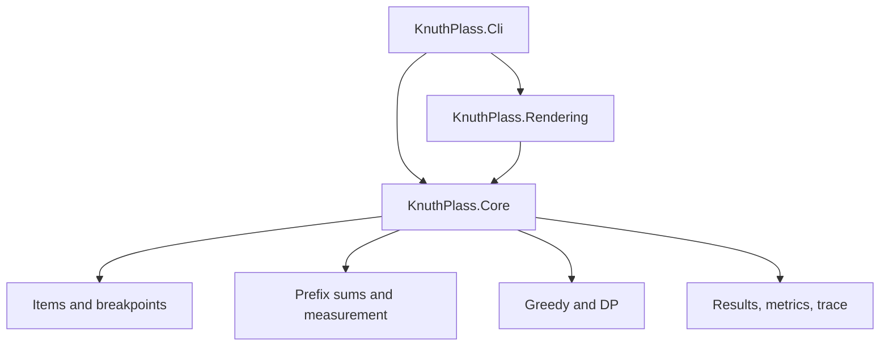
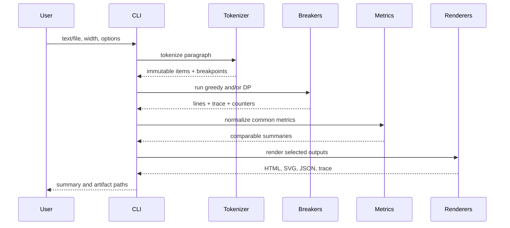

# Architecture

## Component view

Dependency direction is one-way. `Core` references no other production project. `Rendering` converts immutable results to strings/streams. `Cli` owns parsing, file I/O, directory creation, exit codes, and orchestration.

## Runtime sequence

## Key types and responsibilities

| Type | Responsibility | Must not do |
|---|---|---|
| `ParagraphTokenizer` | Normalize input and create immutable item sequence | Choose line breaks |
| `PrefixSums` | Cache range aggregates | Interpret breakpoint policy |
| `LineMeasurement` | Apply boundary rules and formulas | Retain DP state |
| `GreedyLineBreaker` | Choose farthest feasible local break | Reimplement metrics math |
| `KnuthPlassLineBreaker` | Find minimum-demerit fitness-aware path | Write files or format trace |
| `MetricsCalculator` | Recalculate comparable paragraph metrics | Mutate breaker results |
| `ITraceSink` | Receive typed ordered decision events | Decide what is optimal |
| Renderers | Escape and format immutable data | Re-run the algorithm |
| CLI | Validate external input and coordinate services | Contain mathematical rules |

## Result model

`LineBreakResult` contains algorithm name, status, immutable `BrokenLine` collection, selected breakpoint IDs, paragraph metrics, candidate counters, and trace events when enabled. A failed result contains a typed `FailureReason` and diagnostics but no partial line collection presented as success.

`BrokenLine` contains source item/index boundaries, ordered boxes, the exact normalized layout-item span, the selected endpoint penalty, natural/target/rendered widths, stretch, shrink, ratio, badness, line demerits, accumulated demerits, fitness, break penalty, and flags such as `IsLast` and `IsOverfull`.

## Determinism

- Preserve source order everywhere.
- Never enumerate a hash-based collection to select a winner or render output.
- Define epsilon-aware tie-breaking in one comparer.
- Omit timestamps from generated content by default.
- Normalize path separators in human and JSON output where snapshots require it.
- Keep SVG element IDs derived from stable indices, not random GUIDs.

## Error model

Expected failures use result/validation types, not exceptions: invalid options, empty input, unreachable final breakpoint, and strict overfull line. Exceptions are reserved for programmer errors and environmental I/O failures; the CLI maps them to documented exit codes.

## Security and robustness

Input is untrusted text. Enforce a configurable maximum input length and breakpoint graph threshold. Escape HTML/XML and replace characters forbidden by XML 1.0 with U+FFFD; do not interpolate text into CSS, element IDs, paths, or JavaScript. Renderers reject options, paragraphs, or target widths that do not match the captured successful results. Resolve outputs beneath the requested output directory with fixed filenames. Do not overwrite the input file when output and input directories overlap.

## Architecture decisions

### ADR-001: synthetic width metrics

Status: accepted for MVP. Each ordinary character has width 1 and spaces are represented by glue. This isolates the algorithm, makes tests portable, and avoids shaping/kerning dependencies. A future `ITextMeasurer` can replace it without changing line breaking.

### ADR-002: fitness-aware DP state

Status: accepted. Because transition cost depends on adjacent fitness classes, a single cheapest state per breakpoint is not sufficient. Retain the cheapest state per `(breakpoint, fitnessClass)`.

### ADR-003: render from result data

Status: accepted. Renderers never infer widths or break boundaries. This prevents console, HTML, SVG, and JSON from disagreeing.

### ADR-004: explicit last-line policy

Status: accepted. Default `Ragged` assigns zero ratio/badness when the final line fits naturally. `Justified` is available for experiments. The exception is named and tested.

